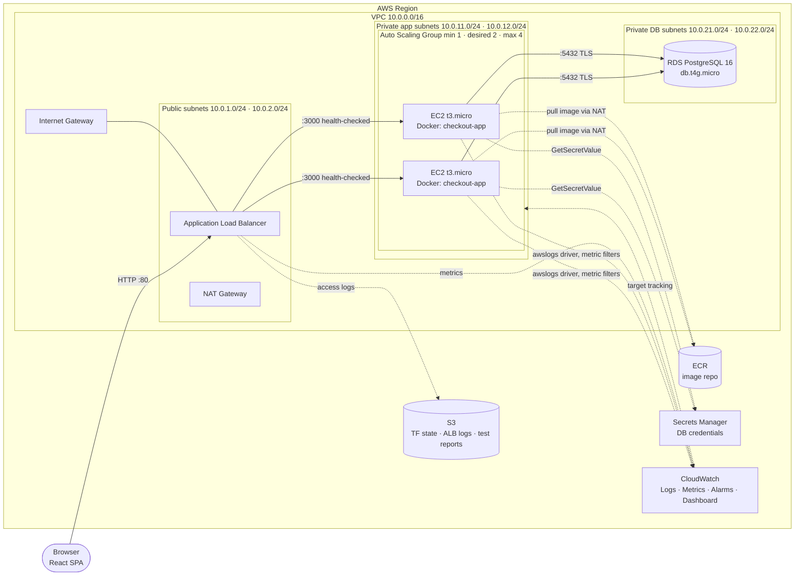

# 01 — Architecture & Design Decisions

> Phase 1 deliverable. Status: **awaiting review**.

## 1. High-level architecture

### Request flow (checkout)
1. Browser loads the React SPA from the ALB (static files are served by the same container).
2. The cart is kept **client-side** (localStorage), so the app tier holds no state.
3. On "Place order", the SPA sends `POST /api/orders` with an `Idempotency-Key` header (a UUID generated once per checkout attempt).
4. The ALB routes the request to any healthy instance (round robin).
5. The instance re-prices the cart from the DB (client prices are never trusted), reserves stock atomically, writes a `PENDING` order, calls the mock payment service, and then marks the order `PAID` or `PAYMENT_FAILED` (releasing stock on failure).
6. Any retry or double-click with the same key returns the **same** order. No duplicate is created.

## 2. Component decisions

| Area | Decision | Why / trade-off |
|---|---|---|
| Frontend | React + Vite SPA, built in a multi-stage Docker build and served by Express | One origin, so no CORS. No extra service (S3 website/CloudFront). Frontend and backend code stay in separate folders. *Alternative:* S3 + CloudFront (more moving parts; a public S3 website has no HTTPS). |
| Backend | Node 22 LTS in the container (Node 20 reached end-of-life in April 2026), Express 5, `pg`, `zod` (validation), `pino` (JSON logs), `helmet` | Small and standard. JSON logs can be queried in CloudWatch Logs Insights. |
| App state | Stateless instances. Cart in browser, orders in RDS | Required for horizontal scaling: any instance can serve any request, and scale-in loses nothing. Removes the need for sticky sessions, Redis or DynamoDB. |
| Database | RDS PostgreSQL 16, `db.t4g.micro`, Single-AZ, 20 GB gp3, encrypted, TLS enforced | Orders need ACID transactions and constraints (unique idempotency key, `stock >= 0`). Multi-AZ doubles cost; it is documented as the production upgrade (see SLA). |
| NoSQL | **Not used** | The data is relational and transactional. DynamoDB would add a second consistency model with no real benefit. |
| Secrets | RDS-**managed** master password in Secrets Manager (`manage_master_user_password`) | No password appears in code, `.tfvars` or Terraform state. Instances read it through their IAM role. ~$0.40/month. |
| Compute | EC2 `t3.micro`, Amazon Linux 2023, launch template + ASG across 2 AZs | Required by the brief. Shows IaaS VMs and containers side by side. |
| Containers | Docker on EC2 (not ECS) | Keeps the VM-vs-container distinction visible. User-data installs Docker, pulls from ECR and runs the container with the `awslogs` log driver. ECS/Fargate is the production alternative and is mentioned in the report. |
| Deploys | New image tag → Terraform updates the launch template → **ASG instance refresh** (rolling, min-healthy 50%) | Zero-downtime rolling deploys with no extra tooling. |
| Scaling | Target tracking: **`ALBRequestCountPerTarget`** (primary) + **CPU 60%** (secondary) | Node checkout is I/O-bound (waits on DB and payment), so CPU alone may barely move. Request count is deterministic and easy to demonstrate. The ASG scales out if *either* policy breaches and scales in only when *both* allow it. |
| Health checks | ALB → `GET /api/health` (liveness, no DB). `GET /api/health/ready` checks the DB | If the ALB health check included the DB, a short RDS blip would mark *every* instance unhealthy and the ASG would replace all of them. Readiness is monitored by an alarm instead. |
| Admin access | **SSM Session Manager**: no SSH, no port 22, no key pairs | A smaller attack surface, and access is logged. |
| HTTPS | HTTP only on the ALB by default | HTTPS needs an ACM certificate, which needs a domain you own. If you have one, it is a ~20-line Terraform addition. |
| Payments | Mock module with configurable latency (100–300 ms) and a "decline" test card | Realistic latency for load testing with no external dependency. |
| Auth | **Out of scope** (guest checkout; order IDs are unguessable UUIDs) | Auth adds a lot of work (Cognito/JWT) and teaches nothing about scaling. It is listed as future work. |

## 3. Networking design (Unit VI)

| Subnet tier | CIDRs (AZ a / AZ b) | Route table | Contents |
|---|---|---|---|
| Public | 10.0.1.0/24, 10.0.2.0/24 | `0.0.0.0/0 → IGW` | ALB, NAT Gateway |
| Private-app | 10.0.11.0/24, 10.0.12.0/24 | `0.0.0.0/0 → NAT` | EC2 instances (private IPs only) |
| Private-DB | 10.0.21.0/24, 10.0.22.0/24 | local only | RDS (no internet route at all) |

Two AZs are the minimum: the ALB and the RDS subnet group both require subnets in two or more AZs. Region: **ap-southeast-2 (Sydney)**, AZs `ap-southeast-2a` and `ap-southeast-2b`. *(Changed in Phase 4 from ap-south-1: the AWS project is assigned to Sydney, and a project can create Regional resources only in its assigned Region.)*

*Added in Phase 3:* a free **S3 gateway endpoint** on the app and public route tables. ECR image layers are served from S3, so image pulls bypass the NAT Gateway and avoid NAT data charges.

**Security groups (chained, least privilege):**

| SG | Inbound | Outbound |
|---|---|---|
| `alb-sg` | TCP 80 from `0.0.0.0/0` | TCP 3000 → `app-sg` |
| `app-sg` | TCP 3000 **from `alb-sg` only** | 443 → anywhere (ECR, Secrets Manager, CloudWatch via NAT); 5432 → `db-sg` |
| `db-sg` | TCP 5432 **from `app-sg` only** | none |

**Cost toggle:** `enable_nat_gateway = false` puts instances in the public subnets with public IPs. Inbound traffic is still restricted to `alb-sg`, so the instances are unreachable except through the ALB. **Since Phase 4 the default is `false`** (decision and reasoning in docs/06 §7). It saves ~$0.054/h in Sydney, about 30% of the hourly cost. The private-subnet + NAT design above is unchanged and can be turned on for a session with `enable_nat_gateway = true`, for example to capture route-table evidence for the report.

## 4. Correctness under concurrency

- **Duplicate checkout prevention:** `orders.idempotency_key UUID UNIQUE`. The insert uses `ON CONFLICT DO NOTHING`. If the key exists, the server compares a SHA-256 hash of the request body:
  - same body, order finished → `200` with the original order (safe replay)
  - same body, still `PENDING` → `409 Conflict` "in progress"
  - same body, order `EXPIRED` by the pending-order reaper → `409 CHECKOUT_EXPIRED` (Phase 5)
  - different body → `422` "idempotency key reused with different payload"

  Because the constraint lives in the **database**, this works across all instances. Per-instance in-memory checks would not.
- **No overselling:** `UPDATE products SET stock = stock - $q WHERE id = $id AND stock >= $q`. If 0 rows are updated, the order is rolled back with `409 OUT_OF_STOCK`. A `CHECK (stock >= 0)` constraint is the backstop.
- **Server-side pricing:** totals are computed from DB prices. Money is stored as integer cents.
- **Migrations:** run at container start under a Postgres **advisory lock**, so several instances booting at once cannot race.
- **Connection budget:** pool of 10 per instance × max 2 instances = 20 connections (max 4 → 40 if the vCPU quota is raised), well under the ~80 a `db.t4g.micro` allows.
- **Stuck checkouts:** a reaper on every instance expires orders left `PENDING` for over 10 minutes (an instance died mid-checkout) and releases their stock exactly once (docs/02, "Stale PENDING orders").
- **Graceful shutdown:** on `SIGTERM` (scale-in or instance refresh), stop accepting requests, finish in-flight ones and close the pool. The ALB deregistration delay is set to 30 s.

## 5. Observability (Unit V)

- **Logs:** Docker `awslogs` driver → log group `/checkout/app` (7-day retention). Request logs are JSON (method, path, status, latency, instance-id, request-id).
- **Custom metrics:** every checkout writes a structured log event (`{"event":"checkout","outcome":"paid|declined|replayed","latencyMs":…}`). Phase 5 turns these into `OrdersPlaced`, `OrdersFailed` and `CheckoutLatency` with **CloudWatch Logs metric filters**. No SDK calls or extra IAM are needed.
  *(Changed in Phase 2: the original plan said Embedded Metric Format. EMF is only extracted when the log shipper sends the `x-amzn-logs-format: json/emf` header, and Docker's `awslogs` driver does not send it.)*
- **Dashboard** (Terraform, `cc-checkout-dev`): ASG in-service/desired, ALB requests and requests per target, target health, TargetResponseTime p50/p95, 5xx/4xx, EC2 CPU, RDS CPU/connections/free storage, OrdersPlaced/OrdersFailed, CheckoutLatency p50/p95, AppErrors, and an alarm overview.
- **Alarms:** ALB 5xx rate > 5% (only when ≥ 10 req/min), **HealthyHostCount < 1** for 2 min, p95 latency > 1 s, RDS CPU > 80%. Optional SNS email (`alarm_email`). *(Changed in Phase 5: the plan said UnHealthyHostCount > 0, but a new instance is unhealthy for ~2 min during every scale-out (docs/07 §3), so that alarm would fire on normal scaling. "No healthy target" is the real outage signal.)*
- **Footer badge:** the SPA shows "served by `i-0abc…` (us-east-1a)" via `GET /api/instance`, so load balancing and scaling are visible during the demo.

## 6. Availability & SLA view

| Component | AWS SLA |
|---|---|
| ALB | 99.99% |
| EC2 (region-level, multi-AZ) | 99.99% |
| RDS Single-AZ | 99.5% |
| RDS Multi-AZ | 99.95% |

Composite (serial) ≈ 0.9999 × 0.9999 × 0.995 ≈ **99.48%**. The database is the weakest link, and Multi-AZ would raise the composite to ~99.93% for roughly 2× the DB cost.

**Project SLOs:** 99% availability during test windows, checkout p95 < 500 ms at target load, error rate < 1%.

## 7. CI/CD (Unit V — DevOps)

- **CI** (every push/PR): lint, unit tests, integration tests against a Postgres service container, Docker build, `terraform fmt -check`, `terraform validate`.
- **CD**: `scripts/deploy.sh`, run by the operator with a short-lived `aws login` session. It builds and pushes the SHA-tagged image, applies only the image change through Terraform (guarded), waits for the rolling refresh and verifies the new version. *(Changed in Phase 5: GitHub OIDC was planned, but the AWS project's managed policy denies creating IAM OIDC providers, so CI has no AWS access at all. See docs/09-ci-cd.md.)*
- `terraform apply` / `destroy` stay **manual and local** so you control spend.

## 8. Terraform layout

Two stacks separate cheap persistent resources from hourly-billed ones:

- **`infra/bootstrap/`** (apply once, keep; pennies/month): S3 state bucket (versioned, encrypted, native S3 lockfile), ECR repo with a lifecycle policy (keep the last 5 tagged releases; untagged leftovers removed), AWS Budget alert ($10). (The planned GitHub OIDC role is not possible in this AWS project; see docs/09.)
- **`infra/envs/dev/`** (apply for a session, destroy afterwards): composes modules `network`, `security`, `database`, `alb`, `compute`, `monitoring`.

Everything is driven by variables (region, CIDRs, instance type, ASG sizes, scaling targets, image tag), and outputs include the ALB URL, ASG name and dashboard URL.

Putting ECR in bootstrap also solves the ordering problem: the image already exists before the ASG launches.
